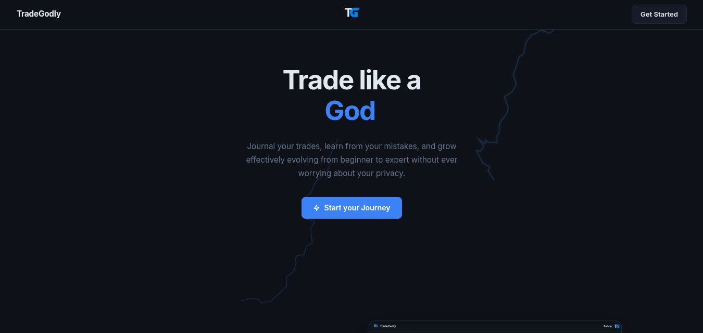

<div align="center"></div>

# TradeGodly
Journal your trades, learn from your mistakes, and grow effectively evolving from beginner to expert without ever worrying about your privacy.

# ⚙️ Installations
## Github
```
git clone https://github.com/firstdecree/tradegodly
```

## NpmJS
```
npm install
```

## PNPM
```
pnpm install
```

# 🛠️ Setup
In order to run TradeGodly, it is first necessary to configure it by making adjustments to the `example.config.toml` (remove the `example.` part in the name afterwards) file. All of the necessary descriptions for each variable are already included.

# 📦 Deployment
To deploy TradeGodly, first create a [Vercel](https://vercel.com/) account. Then, install Vercel with the command `npm i vercel -g` and run the command `vercel --prod`. It's done! You can now use it on your websites.

# 🚀 Usage
```
node index.js
```

# 🌟 Backers & Sponsors
<table border="1">
    <tr>
        <td style="text-align: center; padding: 10px;">
            
            <br>
            <p align="center"><a href="https://vexhub.dev/">Vexhub Hosting</a></p>
        </td>
        <td style="text-align: center; padding: 10px;">
            
            <br>
            <p align="center"><a href="https://vercel.com/">Vercel</a></p>
        </td>
    </tr>
</table>

<div align="center">
  <sub>This project is distributed under <a href="/LICENSE"><b>MIT License</b></a></sub>
</div>